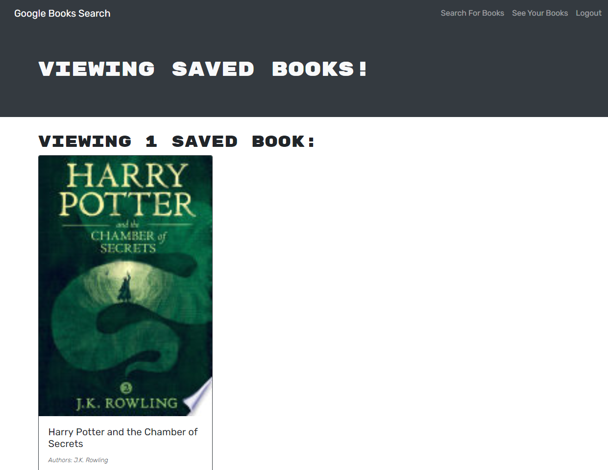

# book-search-engine

## Description
  
This project was undertaken as part of a coding bootcamp run through the University of Western Australia. 

A fully functioning Google Books API search engine built with a RESTful API was reconfigured to be a GraphQL API built with Apollo Server. 

Link to Deployed Application: [Book Search Engine](https://stephje-book-search-engine.herokuapp.com/)

## Table of Contents
  
  - [Installation](#installation)
  - [Usage](#usage)
  - [Contributing](#contributing)
  - [Questions](#questions)
  - [Screenshots of Deployed Application](#screenshots-of-deployed-application)
  
## Installation
  
  
Application is deployed via Heroku. If running locally, enter `npm i` from the command line to install required packages. Requires MongoDB. 
  
## Usage
  
To run locally in development mode, run `npm run dev` from the command line to initialize. 

## Contributing
  
To contribute to this project, please reach out to the creator via email (contact details below).

## Questions
  
For any questions pertaining to this project, the developer can be reached via any of the contact methods listed below. 

Please ensure that you include the name of this project ("book-search-engine") in any communications. 

- [GitHub](https://github.com/stephje)
- [Email](mailto:s.jenkins3018@gmail.com)

## Screenshots of Deployed Application

  
